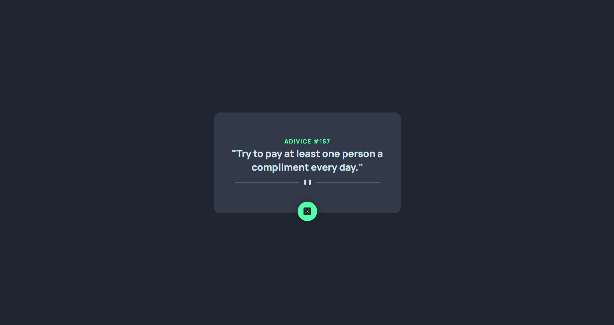
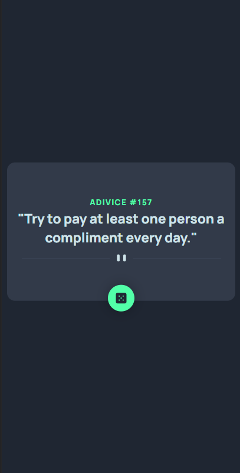

# Frontend Mentor - Interactive card details form solution

This is a solution to the [Interactive card details form challenge on Frontend Mentor](https://www.frontendmentor.io/challenges/interactive-card-details-form-XpS8cKZDWw). Frontend Mentor challenges help you improve your coding skills by building realistic projects. 

## Table of contents

- [Overview](#overview)
  - [Screenshot](#screenshot)
  - [Links](#links)
- [My process](#my-process)
  - [Built with](#built-with)
- [Author](#author)

## Overview

### The challenge

Users should be able to:

- View the optimal layout for the app depending on their device's screen size
- See hover states for all interactive elements on the page
- Generate a new piece of advice by clicking the dice icon

### Screenshot

### Links

- Solution URL: [solution](https://github.com/newberg85/advice-generator-app)
- Live Site URL: [site](https://advice-generator-app-xi-five.vercel.app/)

## My process

### Built with

- [Next.js](https://nextjs.org/) - React framework
- [React](https://reactjs.org/) - JS library
- Tailwind
- API Consumption

## Author

- Github - [Wandemberg](https://github.com/newberg85)
- Frontend Mentor - [@newberg85](https://www.frontendmentor.io/profile/newberg85)
- Instagram - [@new.berg85](https://www.instagram.com/new.berg85/)
- Behance - [Wandemberg](https://www.behance.net/bergviana)

